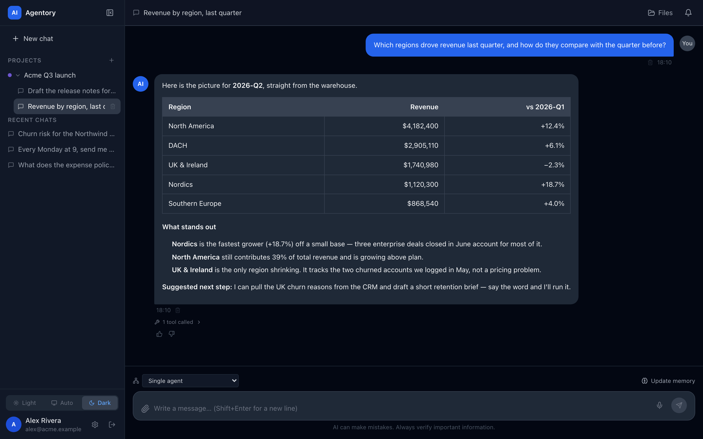
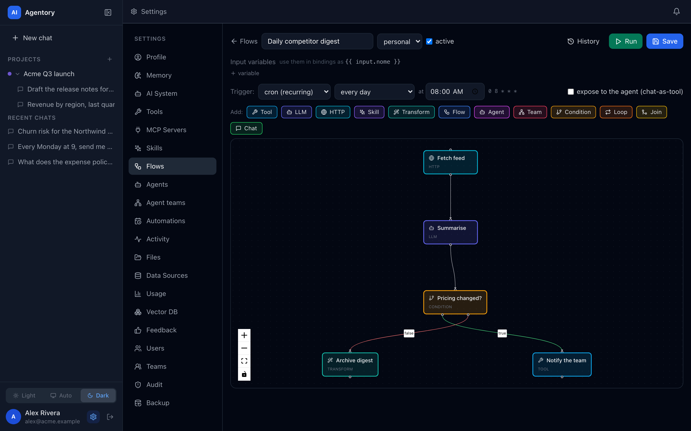
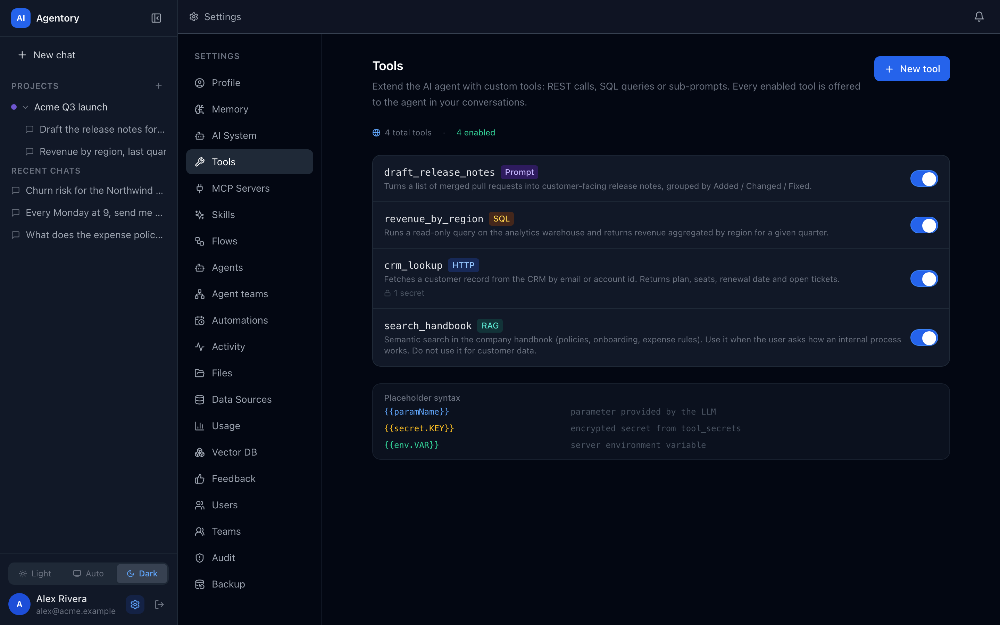
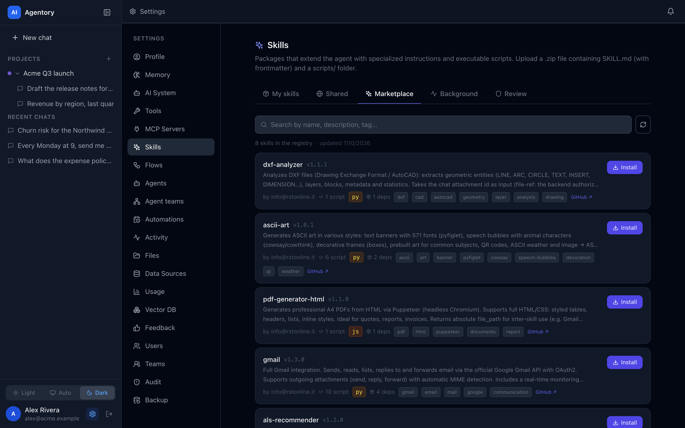
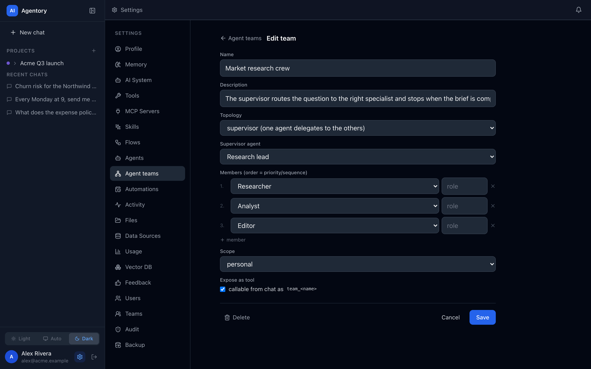
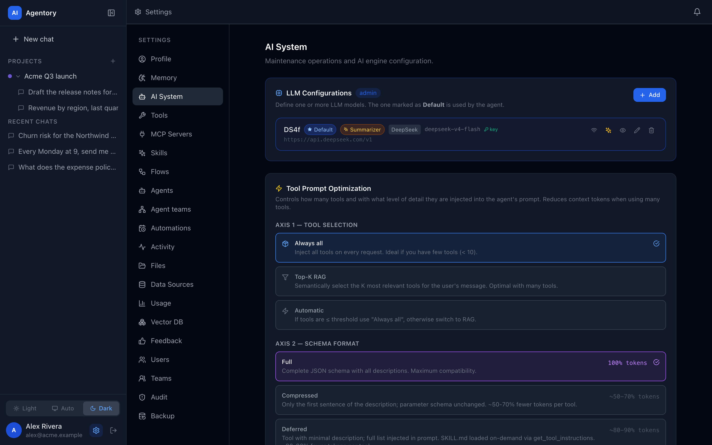

<div align="center">

# Agentory

**The sovereign, self-hosted AI platform for teams.**
Run AI agents, deterministic workflows, and sandboxed custom code — multi-tenant, on your own infrastructure, with your data never leaving the building.

[](LICENSE)
[](docs/LICENSING.md#contributions)


🇬🇧 English · [🇮🇹 Italiano](README_it.md)

</div>

---

## Why Agentory?

Most self-hosted AI tools pick one lane: a chat UI (Open WebUI, LibreChat), an app/agent builder (Dify, Flowise), or a workflow automator (n8n). **Agentory is the one place that combines all three under a real multi-tenant governance model** — so a whole organization can run AI on infrastructure it controls, without shipping data to a third-party SaaS.

The defensible combination, in one product:

- 🧠 **Stateful agents** (LangGraph ReAct) *and* 🔀 **deterministic workflows** (DAG canvas) — improvisation *and* repeatability.
- 🧩 **Executable Skills** — run untrusted Python/Node/JS in a hardened, per-job sandbox.
- 🔌 **Native MCP** (Model Context Protocol) — `http` · `sse` · `local` · `remote` transports.
- 🏢 **Multi-tenant by design** — org · team · user, with `personal | team | org` resource scoping and multi-team shared projects.
- 🗄️ **Heterogeneous data sources** — SQL (Postgres/MySQL/MSSQL/Oracle/SQLite), MongoDB, Redis, and file shares (SMB/SFTP/WebDAV).
- 🔒 **Capability-based security** — every power (network, filesystem, SQL ops, local MCP) is declared and approved, with safe defaults.

> **Data sovereignty is the point.** Bring your own LLM (Anthropic, OpenAI, Gemini, Ollama, LM Studio, DeepSeek, any OpenAI-compatible endpoint) or run models locally. Nothing leaves your perimeter unless you say so.

## Screenshots

|  |  |
| :--: | :--: |
| <br/>**Chat** — a stateful agent that picks the right tool, runs it, and answers with the result. | <br/>**Flows** — deterministic DAG workflows: HTTP, LLM, conditions, tools, skills, sub-flows, on a cron. |
| <br/>**Tools** — custom REST / SQL / RAG / prompt tools, with encrypted secrets and `personal · team · org` scoping. | <br/>**Skills** — install executable Python/Node/JS packages from the registry; they run in a sandbox. |
| <br/>**Agent teams** — compose agents with a topology (supervisor / sequential / parallel) and expose the team as a tool. | <br/>**AI System** — multiple LLM configs (default / summarizer / vision) and tool-prompt optimization. |

## Quick start

> Requires Docker + Docker Compose. This spins up the full stack (Postgres, Qdrant, Redis, embedding & whisper services, skill executor, backend, frontend).

```bash
git clone https://github.com/agentoryhq/agentory.git
cd agentory
./scripts/install.sh
```

The **guided installer** does everything: Docker preflight → generates all secrets → you pick an isolation level for skill/sandbox execution (**Standard / Isolated / Maximum**) → builds the required images → starts the stack. It's idempotent — safe to re-run. Afterwards, manage the stack with the wrapper it generates:

```bash
./scripts/compose.sh ps         # status
./scripts/compose.sh logs -f    # follow logs
./scripts/compose.sh down       # stop
```

<details>
<summary><b>Manual setup</b> (without the installer)</summary>

```bash
cp .env.example .env
```

Fill in the required secrets in `.env` (the backend **fails fast** if any are missing or weak — generate each with `openssl rand -hex 32`):

```bash
JWT_SECRET=          # min 32 random chars — app won't start otherwise
TOOL_SECRETS_KEY=    # 64 hex chars — AES-256-GCM key for secrets at rest
RUN_TOKEN_SECRET=    # signs internal run tokens
SERVICE_API_KEY=     # auth mesh: backend ↔ executor ↔ broker
DB_PASSWORD=         # Postgres password
```

Then start it:

```bash
# Development (exposes service ports, dev conveniences)
docker compose up -d

# Production (internal services have NO host ports; requires the secrets above)
docker compose -f docker-compose.yml up -d
```

For the isolation overlays (broker / egress allowlist) that `install.sh` wires automatically, see **[GUIDE.md](docs/GUIDE.md)**.

</details>

- Frontend → http://localhost:5173
- Backend API → http://localhost:3000 · Swagger → http://localhost:3000/api/docs

The **first user to register becomes the admin**. LLM providers, embeddings, and the vector DB are configured from the UI (**Settings → AI System**) — no API keys in files.

For non-Docker development, LAN access, and the optional hardening overlays, see **[GUIDE.md](docs/GUIDE.md)**.

## The four pillars

Beyond chat, four integrated systems — and they interconnect (flows are agent tools and can invoke agents/teams; automations run headless and may use a team):

| Pillar | What it does |
|---|---|
| 🤖 **Agent** | LangGraph ReAct agent with custom tools, MCP servers, RAG, and a 4-layer system prompt (base → user → project → skills). |
| 🔀 **Flows** | Visual DAG canvas for repeatable workflows. 12 node types (`tool`, `llm`, `condition`, `http`, `skill`, `transform`, `flow`, `agent`, `team`, `loop`, `join`, `chat`); triggers: manual, cron, scheduled, webhook, chat-as-tool. |
| 👥 **Multi-Agent** | Reusable agents composed into teams with `supervisor` / `sequential` / `parallel` topologies. Agent-as-tool for hierarchical delegation. |
| ⏰ **Auto-Scheduling** | Schedule automations *from chat* ("every morning at 8, check email and summarize"). Confirmed-by-default, headless runner, delivery via notification or a dedicated chat thread, with per-run token/cost guardrails. |

More capabilities: no-code **custom tools** (HTTP/SQL/RAG/prompt), **scope-aware RAG** (universal/project/personal), **DataSources**, **executable Skills**, an arbitrary-code **Sandbox** (`run_in_sandbox`), **SSE streaming** with automatic file detection, voice input (Whisper), i18n (EN/IT), and an Electron **bridge** for local MCP processes.

👉 Full feature reference and architecture: **[PROJECT.md](docs/PROJECT.md)**. Building Skills: **[SKILLS.md](docs/SKILLS.md)**.

## Tech stack

| Layer | Technology |
|---|---|
| Backend API + Agent | NestJS 10 (TypeScript) |
| AI orchestration | LangChain.js + LangGraph |
| LLM | UI-configurable: Anthropic, OpenAI, Gemini, Ollama, LM Studio, DeepSeek, any OpenAI-compatible |
| Frontend | React 18 + Vite + Tailwind CSS |
| App database | PostgreSQL + TypeORM |
| Vector DB | Qdrant (default) / PGVector / Chroma / AstraDB |
| Queue / scheduler | BullMQ + Redis |
| Skill executor | Node.js (Fastify) sidecar — Python/JS/Node runners |
| Skill isolation | Egress allowlist (Squid), declared `network`/`filesystem` capabilities, per-job containers via broker (cap-drop, read-only, non-root, optional gVisor) |
| Packaging | Docker Compose (secure base + `egress`/`broker` overlays) |

## Architecture

```
[Browser]
    │
    ├── React SPA (Vite + Tailwind) — JWT auth · SSE streaming · file upload
    │
    └── REST + SSE /api/* ◄─────────────────────────────────────────────┐
                   ▼                                                      │
           NestJS Backend :3000                                          │
                   │                                                      │
              AgentModule — LangGraph ReAct Agent                        │
                   │                                                      │
    ┌──────────────┼──────────────────────────┐                          │
    ▼              ▼              ▼            ▼                          │
CustomTools    McpServers   DataSources   VectorDb                       │
 http/sql/rag  http/sse/    SQL/Mongo/    Qdrant/PGV/                     │
               local/remote Redis         Chroma/Astra                   │
                   │                                                      │
              McpBridgeGateway (WebSocket /mcp-bridge)                    │
                   │                                                      │
              Electron Bridge ◄────────────────────────────────────────┘
              └─ McpProcess (stdio → JSON-RPC)
```

## Security & isolation

Agentory uses a **capability model**: every power (network, filesystem, SQL operations, `local` MCP) is *declared and approved*, with safe defaults and a ceiling tied to identity — never implicit and global.

- **AES-256-GCM** authenticated encryption for secrets; `TOOL_SECRETS_KEY` mandatory (fail-fast).
- **Secure Docker prod**: internal services have no host ports; passwords required.
- **`local` MCP** restricted to admins; **SSRF guard** on `http`/`sse` (blocks cloud metadata, RFC1918, localhost).
- **Skills** (untrusted third-party code): egress allowlist, per-tenant access-aware filesystem, hardened per-job containers via the broker, declared capabilities, package checksums.
- **Structured audit log** on chokepoints (auth, admin, executions, files, SQL, MCP) with "runs-as" identity.

## Documentation

| Doc | Contents |
|---|---|
| [PROJECT.md](docs/PROJECT.md) | Full product & architecture deep-dive |
| [GUIDE.md](docs/GUIDE.md) | Usage & development guide (setup, overlays, LAN, dev notes) |
| [SKILLS.md](docs/SKILLS.md) | How to build Skills (schema, templates, conventions) |
| [MEMORY.md](docs/MEMORY.md) | Agentic memory (A-MEM) design |
| [LICENSING.md](docs/LICENSING.md) | License (AGPL-3.0) & contribution terms |
| [THIRD_PARTY_NOTICES.md](docs/THIRD_PARTY_NOTICES.md) | Third-party attributions |

## Contributing

Contributions are welcome! They are accepted under the project's license — **AGPL-3.0**, *inbound = outbound*: by opening a Pull Request you agree to license your contribution under AGPL-3.0. No CLA required.

## Support the project

Agentory is free and open source under AGPL-3.0. If it is useful to you or your organization, you can support its ongoing development through [GitHub Sponsors](https://github.com/sponsors/andreagenovese). Sponsorship is entirely voluntary: it does **not** change the license or grant any additional rights — it simply helps sustain maintenance and new features.

## License

Agentory is free and open source under the **GNU AGPL-3.0** (see [LICENSE](LICENSE) and [LICENSING.md](docs/LICENSING.md)):

- 🆓 Free to use, modify, and self-host — including as a network service (SaaS) — **provided you make the corresponding source code available under AGPL-3.0** (network copyleft, art. 13).
- The software is provided **"AS IS", without warranty or liability** (AGPL-3.0 §15–16).

All bundled dependencies are under permissive (MIT, ISC, BSD, Apache-2.0) or weak file-level copyleft (MPL-2.0, build tooling only) licenses — **no strong copyleft (GPL/LGPL) among the dependencies**. See [THIRD_PARTY_NOTICES.md](docs/THIRD_PARTY_NOTICES.md).
